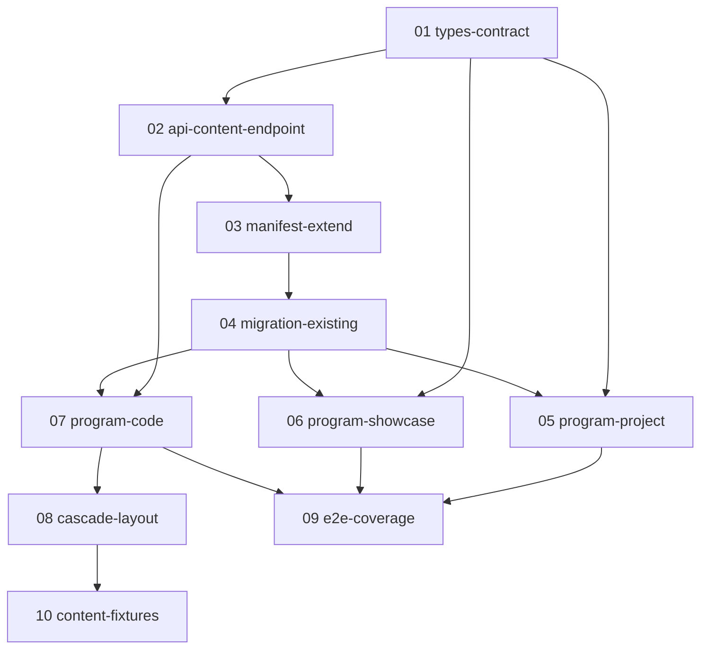

# Wave: claude-design pages — implementation overview

> **Источник дизайна**: `claude-design/Project + Showcase.html` + `claude-design/scenes.jsx` + `claude-design/design-canvas.jsx` + `claude-design/styles/dimonya-os.css`.
> **Источник архитектуры**: [CLAUDE.md](../../../CLAUDE.md), [AGENTS.md](../../../AGENTS.md), [docs/RULES.md](../../RULES.md).
> **Wave prefix**: `claude-design-pages`.

## 1. Цель wave

Имплементировать дизайн `claude-design/` в существующую архитектуру окон Dimonya OS:
- **переписать** программу `project` (slider + meta-panel + states);
- **создать** программу `showcase` (single-image viewer);
- **создать** программу `code` (tabs + clipboard, JSON-конфиг для Tilda-сниппетов);
- **добавить** GET endpoint `/api/filesystem/content` — возвращает содержимое папки entry как JSON (entity meta + image URLs + code snippets);
- **добавить** GET endpoint `/api/filesystem/asset` — стримит статику из `server/assets/entry/**/{images,codes}/**`;
- **расширить** контракт `entity.json` (optional `year`, `tags`, `description`, `links`);
- **обеспечить** backward-compat с существующими entity (griboyedov, u24, about).

Всё делается **PR-волной**: каждая таска в этой папке = один PR ≤ 150 LOC. Юзер запустит `dispatch-task-subagent` после approve этого плана.

## 2. DAG зависимостей



**Critical path**: `01 → 02 → 03 → 04`. После 04 — таски 05/06/07 параллельны. 09 финальная regression-стадия.

**Параллелизм для `dispatch-task-subagent`**:
- Wave 1 (sequential): 01 → 02 → 03 → 04.
- Wave 2 (parallel ×3): 05, 06, 07 одновременно (после 04).
- Wave 3 (sequential): 08 (зависит от 07).
- Wave 4 (parallel ×2): 09, 10.

## 3. Контракт `Entity` (расширенный)

См. `01-types-contract.md`. Краткая сигнатура:

```ts
// shared/types/filesystem.ts
export type ProgramType = 'about' | 'explorer' | 'project' | 'tproject' | 'code' | 'showcase';

export type EntityLink = { label: string; href: string };

export type Entity = {
  name: string;
  programType: ProgramType;
  hidden?: boolean;
  // NEW (все optional, backward-compat):
  year?: string;
  tags?: string[];
  description?: string;
  links?: EntityLink[];
};
```

**Backward-compat invariants**:
- Все новые поля `optional`. Existing entity.json (griboyedov, u24, about) парсятся без изменений (verified в task 01 unit-тесте).
- `ProgramType` — union additive, не replace. `getProgram(type) ?? null` runtime fallback сохранён в `app/programs/index.ts`.
- Endpoint `/api/filesystem/get` — без изменений (legacy callers продолжают получать `Entity` без новых полей через тот же handler).

## 4. Контракт папки `server/assets/entry/<slug>/`

```
server/assets/entry/<slug>/
├── entity.json                    # required
├── images/                        # опц., читается если папка существует
│   ├── 01-cover.png               # порядок — lexicographic sort
│   └── 02-listing.png
├── codes/                         # опц., только для programType=code
│   └── <snippet-id>/              # snippet-id MUST match /^[a-z0-9-]+$/
│       ├── meta.json              # { windowTitle, description?, primaryLanguage? }
│       ├── index.html             # опц.
│       ├── styles.css             # опц.
│       └── init.js                # опц.
└── codeWindows.json               # опц., manifest related code-окон (cascade)
```

### Filename whitelist (defense-in-depth)
- `images/*` — `/^[a-zA-Z0-9._-]+\.(png|jpg|jpeg|webp|svg)$/`.
- `codes/<id>/*` filename — `/^[a-zA-Z0-9._-]+$/` + ext в `{html,css,js,json,txt,ts,scss}`.
- `<id>` папки snippet — `/^[a-z0-9-]+$/`.
- Любой файл/директория, не подходящие под regex, **игнорируются** endpoint'ом (warn в dev-логе, silent в prod). Не fail.

### Размер
- Max 100 KB per code source file. Превышение — файл пропускается с warn-логом, остальные отдаются.
- `images/` — без size-cap (статика, отдаётся stream'ом через asset endpoint).

## 5. Endpoints (full spec — `02-api-content-endpoint.md`)

### 5.1. `GET /api/filesystem/content?path=<entity-path>`

Расположение: `server/api/filesystem/content.ts`.

```ts
type EntityContent = {
  path: string;
  entity: Entity;
  images?: string[];          // ['/api/filesystem/asset?path=projects/u24/images/01.png', ...]
  codes?: CodeSnippet[];
  codeWindows?: CodeWindowMeta[];
};

type CodeSnippet = {
  id: string;                 // sanitized snippet-id (= dir name)
  windowTitle: string;
  description?: string;
  files: { name: string; language: string; source: string }[];
};

type CodeWindowMeta = {
  id: string;                 // ссылка на codes/<id>
  windowTitle: string;
  description?: string;
  layout?: 'tile-h' | 'cascade';
};
```

**Правила**:
- `images[]` — **только URL'ы** (template literal `path → /api/filesystem/asset?path=...`). Никаких blob/base64 в JSON-ответе.
- `codes[].files[].source` — raw UTF-8 текст. Sanitization при рендере на фронте (см. task 07 — `<pre><code v-text>` без `v-html`).
- Zod query schema:
  ```ts
  const Q = z.object({
    path: z.string().regex(/^[\w\-/.]+$/).max(200).refine(p => !p.includes('..'))
  });
  ```
- Cache: routeRule `s-maxage=3600, stale-while-revalidate=60` (как existing).

### 5.2. `GET /api/filesystem/asset?path=<file-path>`

Расположение: `server/api/filesystem/asset.ts`.

Назначение: стримит файл из `server/assets/entry/**/{images,codes}/**` с правильным Content-Type и кешированием.

**Альтернатива (рассмотрена)**: складывать ресурсы в `public/`. **Отвергнуто** — `server/assets/` не публичная директория, копирование дублирует контент и ломает manifest hot-reload через `builder:watch`.

**Правила**:
- Zod: тот же regex что у content + ext-whitelist (`png|jpg|webp|svg|html|css|js|json|txt`).
- Stream через `setResponseHeader('Content-Type', mime)` + `sendStream`.
- Cache: `s-maxage=86400` (assets immutable).
- Path traversal protection: `path.resolve()` + `.startsWith(SERVER_ASSETS_ENTRY_ROOT)`, иначе 403.

## 6. SSR / hydration safety

- **Slider в `project`** получает данные через `useFetch('/api/filesystem/content', { key: \`content:\${path}\` })`. Nuxt сериализует payload в SSR HTML → client получает идентичный snapshot → no hydration mismatch.
- **Container queries (`cw`/`ch`/`cwh`)** — pure CSS, рендерятся client-side post-paint, независимы от SSR. Тестируются Playwright snapshot'ом на двух viewport'ах (1280×760 desktop + 420×760 mobile), не unit-тестами.
- **`<NuxtImg>`** для image rendering — handles lazy/responsive sizing.

## 7. Premortem (≥10 рисков с митигациями)

| # | Риск | Митигация | Где fix |
|---|------|-----------|---------|
| 1 | entity.json несовместим с existing (минимальные поля у griboyedov/u24/about) | Все новые поля optional + runtime fallback в endpoint+UI. Task 04 = early migration smoke. Test существующих routes до+после. | task 01, 04 |
| 2 | endpoint читает blob картинок → SSR/cache fail (base64 убивает payload) | Правило section 5: `images[]` только URL'ы. Asset endpoint streams. PR review checklist «не читать blob в content endpoint». | task 02 |
| 3 | code-сниппеты содержат `<script>` → XSS при рендере | `<pre><code v-text="file.source">` (НЕ `v-html`). ESLint `vue/no-v-html` enforce. Test со script-payload: assertion «not executed». | task 07 |
| 4 | manifest не подхватывает новые поля entity.json | Task 03 расширяет `scripts/generate-manifest.ts` + unit-test проверяет manifest содержит year/tags. Lefthook gate. | task 03 |
| 5 | ProgramType enum расширение ломает existing parsing | Union additive (не replace). `getProgram(type) ?? null` runtime fallback. Migration test — все existing entity.json парсятся типом. | task 01 |
| 6 | Container queries hydration mismatch (slider в SSR не знает container size) | SCSS-only `@container window`, рендерится post-paint. SSR HTML идентичен — нет mismatch. Playwright snapshot 2 viewport. | task 05 |
| 7 | html-to-image превью code-окна тяжёлый/падает на больших code blocks | Task 08 — disable preview generation для programType=code; taskbar показывает icon вместо превью. | task 08 |
| 8 | Cascade layout race на focus при многократном спавне code-окон | Sequential spawn (`await createAndRegisterWindow` в цикле). z-stack через existing focus store. Test: 3 code-окна → focus на последнем, z-stack корректный. | task 08 |
| 9 | Pre-commit lefthook валит большой PR | Все таски ≤150 LOC. Отдельный branch per task. dispatch-task-subagent с pre-written task-файлами + critic review per task. | wave-level |
| 10 | Path traversal в endpoint (`path=../../etc/passwd`) | Zod regex `/^[\w\-/.]+$/` + `.refine(p => !p.includes('..'))`. В asset endpoint доп. `path.resolve()+startsWith()` guard. Unit-test malicious payloads. | task 02 |
| 11 | Code source > 100KB убивает payload | Ext-whitelist + max 100KB per file в task 02. Превышение — skip с warn-логом, остальные отдаются. | task 02 |
| 12 | `navigator.clipboard` undefined в insecure context (HTTP не-localhost) или SSR | 3-tier fallback chain в `app/services/clipboard.ts`: Clipboard API → `<textarea>+document.execCommand('copy')` → disabled state кнопки в SSR. | task 07 |
| 13 | TS strict + `noUncheckedIndexedAccess` ломает написание (`tags?.[0] → string \| undefined`) | Explicit guards / early returns в каждом таске. Convention в `## Notes` шаблоне task'а. | wave-level |
| 14 | code-window deep routing неоднозначен (`/projects/x/code/y` vs `/projects/x/code`) | Spec в section 5 + task 07: `/code/<id>` обязательный suffix; `/code` без id → fallback на первый snippet, error state иначе. | task 07 |
| 15 | manifest hot-reload не покрывает codes/ images/ subtree | `nuxt.config.ts builder:watch` уже глобит `server/assets/entry/**` (verified). Task 03 — explicit assertion в `manifest.test.ts`: модификация `codes/<id>/index.html` триггерит regenerate (через mocked watcher). | task 03 |

## 8. Convention task-файлов

Каждый task-файл (01..10) следует шаблону:

```markdown
# Task NN: <name>

## Goal — one-line описание

## Files (touch only)
- `<path>` (~LOC)

## Dependencies
- Tasks: NN, MM
- Reads (без изменений): <files>

## Steps
1. ...

## Success criteria
- bullet list

## Verify
\`\`\`bash
<verify command>
\`\`\`

## Acceptance test
unit | e2e | manual

## Notes
- LOC ≤150 per file
- noUncheckedIndexedAccess gotchas: ...
- SSR-safe: yes/no
- ESLint rules: ...
```

## 9. Out of scope

- Taskbar / Workbench изменения для иконок новых программ → отдельный future PR.
- Темизация — `$colors` в `_settings.scss` НЕ трогаем.
- Keyboard navigation в slider (open question 5 в дизайне) — out of scope MVP, `tabindex` оставлен заранее на viewport.
- Markdown rendering в `description` — пока plain text + `\n → <br>` only; full markdown — future.
- Optimistic clipboard (preflight permissions API) — beyond MVP.

## 10. Acceptance для wave в целом

После merge всех 10 PR:
1. `bun run typecheck` + `bun run lint` + `bun run biome:check` без ошибок.
2. `bun run test:unit` + `bun run test:e2e` зелёные.
3. Existing routes (`/projects/u24`, `/projects/griboyedov`, `/about`) рендерят без regression.
4. Новые routes (`/projects/griboyedov/code/marquee`, deep image path) работают и матчат дизайн.
5. Lighthouse / визуальный diff против `claude-design/screenshots/*.png` приемлем (manual).
